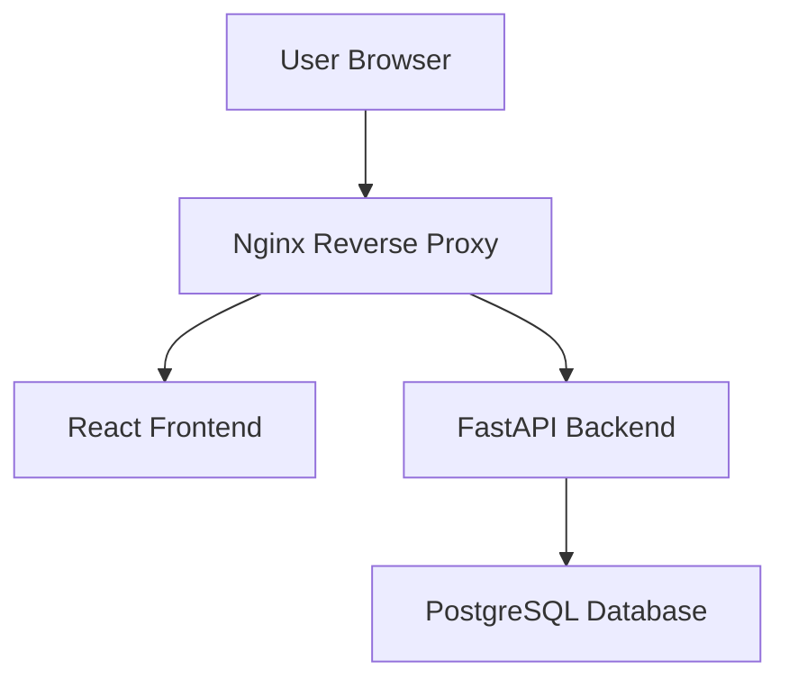

# High-Level Architecture

This diagram presents only the public, high-level structure of TeroPOS. Production addresses, credentials, internal configuration and security-sensitive implementation details are excluded.

## Operational Responsibilities

The project involved:

- Deploying containerised application services
- Configuring reverse-proxy routing and HTTPS
- Managing PostgreSQL database services
- Monitoring application health
- Diagnosing frontend, backend and database issues
- Implementing backup and restoration procedures
- Maintaining role-based user access
- Documenting deployment and troubleshooting procedures

## Security Boundary

This portfolio intentionally excludes:

- Server addresses and access instructions
- Environment variables and credentials
- Authentication internals
- Production Docker and Nginx configuration
- Database schemas and migrations
- Customer and vendor information
- Commercial business rules
